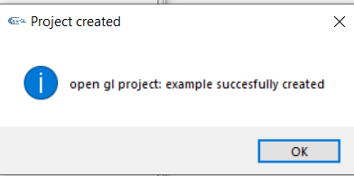

# VSGLProjectCreator
This is a small python tool written to simplify the process of setting up an openGl visual studio project. The tool does:

* Download glew and glfw and build them for 64bits if they are not already in its place.
* Set all the paths link library paths and include files.
* Makes a copy of a standar template project in the selected place.


### Dependencies
* cmake
* python3
* visual studio 17 or above

### Running the script
To run the script you must initialize vcvars64.bat cmd and run the following command:
```sh
C:\VSGLProjectCreator>python3 gen_vsgl.py
```
### Images



